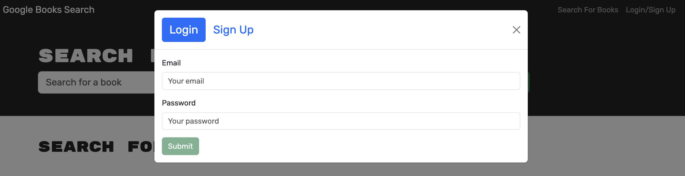
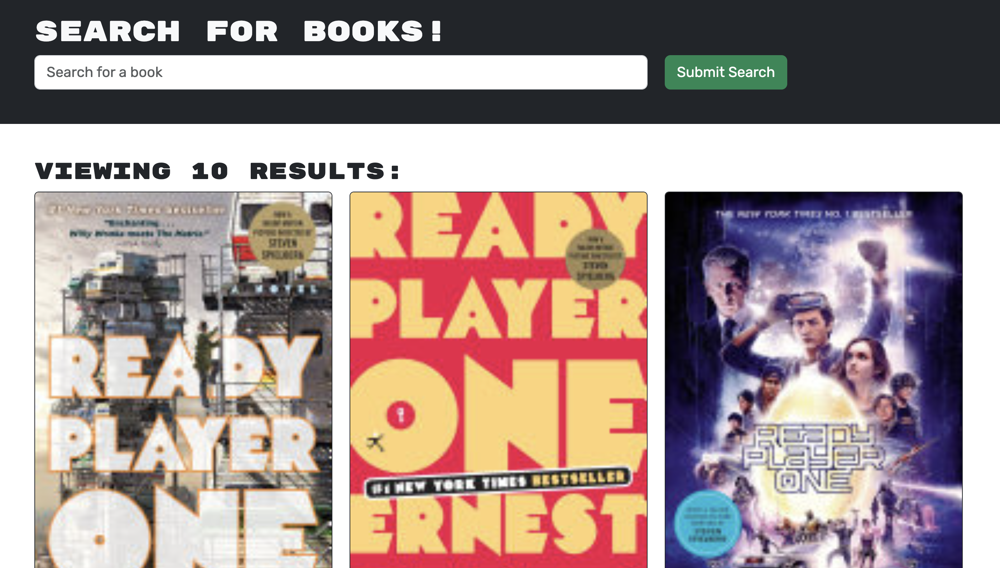
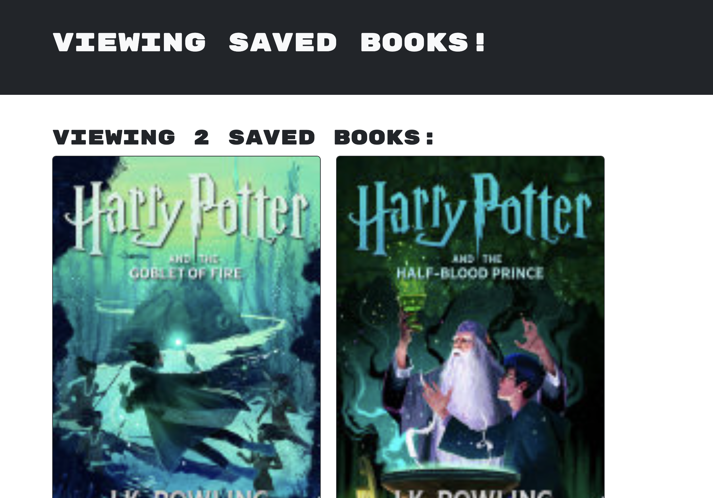

# Book Hero

## Description 📰

Book Hero is an application that allows the user to keep notes on what books they would like to read or purchase in the future. This application utilizes Google's book API to retrieve and display corresponding book information.

The motivation behind this app was to streamline a way for anyone to keep tabs on what books they want to read -- I can't tell you how many times I've come across a book I wanted to read, thought to myself I'll get to it eventually, and totally forget about it. I know I'm not the only one; Book Hero solves that problem.

In making this app, I became more familiar with how to use GraphQL to replace RESTful API, and I also learned how to integrate it within the React framework. On a more granular level, I also learned that although you may be making variables, sometimes it will matter what you name a variable, especially if you are going to pass it to the blueprint of functionality, in this case, typeDefs.

## Table of Contents

&nbsp;&nbsp;&nbsp;&nbsp;&nbsp;&nbsp; ➣ [Installation](#Installation)

&nbsp;&nbsp;&nbsp;&nbsp;&nbsp;&nbsp; ➣ [Usage](#Usage)

&nbsp;&nbsp;&nbsp;&nbsp;&nbsp;&nbsp; ➣ [Contributing](#Contributing)

&nbsp;&nbsp;&nbsp;&nbsp;&nbsp;&nbsp; ➣ [Tests](#Tests)

&nbsp;&nbsp;&nbsp;&nbsp;&nbsp;&nbsp; ➣ [Credits](#Credits)

&nbsp;&nbsp;&nbsp;&nbsp;&nbsp;&nbsp; ➣ [Questions](#Questions)

## Installation 🔌

In order to install, please run `npm i`.

## Usage 🧮

In order to use this app, please run `npm start`.

Once Book Hero is up and running, user can sign up to use the full capabilities of the site or log in if they already have an account via the login/signup modal.

Whether signed in or not, user can search for books via the input box and search button, which will render a list of books corresponding to the search term.

If user is signed in, they have the ability to save books to their list of saved books and delete them.

## Contributing 🍴

In order to contribute, one must fork their repository and create a pull request.

## Tests ⚖️

In order to test, please run `n/a`.

 ## Credits 🤝
  n/a

## Questions 📭

Please enjoy my work at my GitHub, @[mintyry](https://github.com/mintyry).
